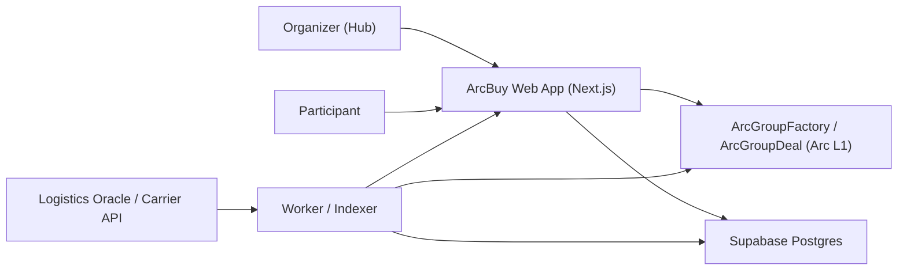
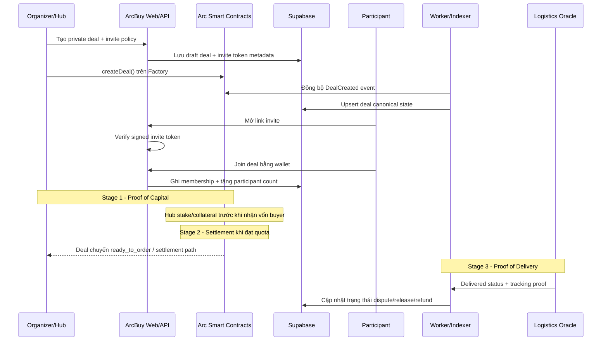
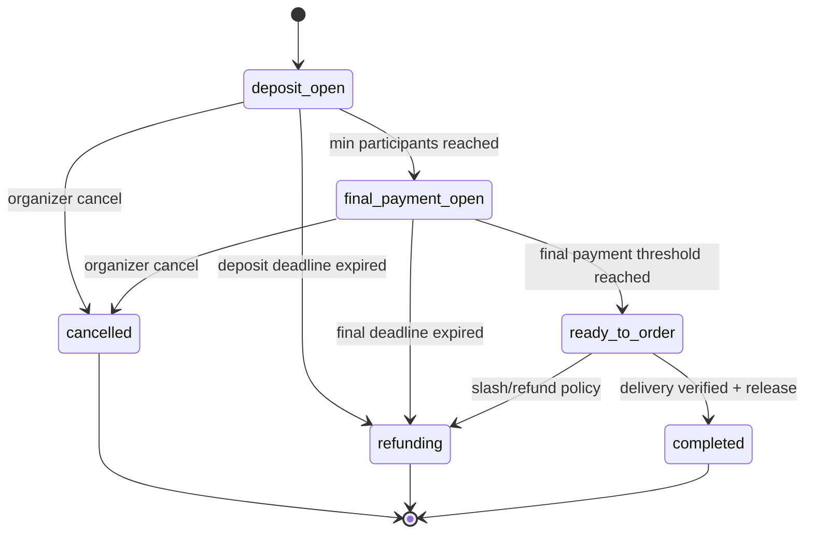

# ArcBuy

ArcBuy là nền tảng **private group-buy** chạy trên Arc testnet, được thiết kế theo mô hình CircleBuy trong các tài liệu:
- Institutional Group Buy Case Study
- Institutional Group Buy Protocol
- On-chain Trust & Governance

Mục tiêu là chuyển mô hình mua chung từ “niềm tin xã hội” sang “luật thực thi bằng smart contract”, với kiến trúc dễ triển khai nhanh:
- Web/API: Vercel
- Worker/Indexer: Railway
- Database: Supabase PostgreSQL
- Smart contracts: Foundry

## 1) Bài toán thực tế

Mua chung truyền thống (P2P) thường gặp các rủi ro:
- Hub/organizer ôm tiền và biến mất (exit scam)
- Tranh chấp giao hàng ở chặng cuối (last-mile fraud)
- Chậm thanh toán xuyên biên giới, chi phí FX cao
- Vốn bị “nằm chết” trong thời gian gom đơn

ArcBuy xử lý bằng 3 lớp proof:
- `Proof of Capital`: Hub stake trước 100% giá trị wholesale
- `Proof of Settlement`: giao dịch thanh toán được ghi nhận on-chain
- `Proof of Delivery`: oracle logistics xác nhận trạng thái giao hàng

## 2) Cơ chế nghiệp vụ cốt lõi

Theo các tài liệu PDF, luồng business chuẩn gồm 3 stage:
- `Stage 1 - Proof of Capital`: Hub nạp stake vào vault trước khi nhận tiền người mua
- `Stage 2 - Settlement`: khi đạt quota, quỹ được settle tới nhà cung cấp qua StableFX logic
- `Stage 3 - Proof of Delivery`: theo dõi tracking, mở dispute window, sau đó release/slash

### Luật chống gian lận
- Hub không thực hiện giao hàng đúng hạn: slash collateral, hoàn tiền buyer
- Buyer claim sai “không nhận hàng”: đối chiếu proof từ carrier API
- Hàng lỗi/tranh chấp: đóng băng quỹ và xử lý theo policy dispute

## 3) Sơ đồ tổng thể hệ thống



## 4) Sơ đồ luồng nghiệp vụ end-to-end



## 5) State machine của deal



## 6) Trust score và governance (theo tài liệu)

Công thức tham chiếu:

`Hub Trust Score = (KYB * 0.3) + (Delivery Speed * 0.4) + (Stake Volume * 0.3)`

Ý nghĩa:
- KYB xác thực pháp nhân giúp loại bỏ danh tính ẩn danh
- Delivery speed phản ánh năng lực vận hành thực tế
- Stake volume phản ánh mức cam kết vốn và độ tin cậy tài chính

## 7) Kiến trúc code hiện tại

```txt
apps/
  web/         Next.js UI + API routes
  worker/      Event indexer + lifecycle reconciliation
packages/
  db/          DB migration runner + record types
  shared/      Shared constants/types/ABI fragments
contracts/     ArcGroupFactory + ArcGroupDeal + tests
supabase/
  migrations/  SQL migrations
.github/
  workflows/   CI pipeline
```

## 8) Các chức năng đã có trong MVP

- Tạo private deal và phát hành invite token có chữ ký server
- Verify invite token trước khi join
- Join deal theo `dealAddress` + `inviteToken` + `participantWallet`
- Theo dõi danh sách deal và chi tiết memberships
- Worker đồng bộ event `DealCreated` từ chain về database
- Worker sweep lifecycle cho các deal hết hạn
- Health và readiness endpoints cho deploy

## 9) API chính

- `POST /api/deals`
  - Tạo/cập nhật deal và trả `inviteToken`
- `GET /api/deals`
  - Danh sách deal (có filter `?status=`)
- `GET /api/deals/:dealAddress`
  - Chi tiết deal + danh sách thành viên
- `POST /api/invites`
  - Verify invite token
- `POST /api/deals/:dealAddress/join`
  - Join private deal
- `GET /api/health`
  - Liveness + DB ping
- `GET /api/readiness`
  - Readiness check env + DB

## 10) Chạy local

1. Cài Node.js 20+ và npm 10+.
2. Cài dependency:
   - `npm install`
3. Copy env:
   - `apps/web/.env.example` -> `apps/web/.env.local`
   - `apps/worker/.env.example` -> `apps/worker/.env`
4. Chạy migration:
   - `npm run db:migrate`
5. Chạy app:
   - `npm run dev:web`
   - `npm run dev:worker`

## 11) Deploy nhanh production-like

- Web/API: Vercel (root `apps/web`)
- Worker: Railway (root `apps/worker`)
- DB: Supabase (pooler `DATABASE_URL`)

Checklist đầy đủ:
- `docs/business-flow-v1.md`
- `docs/arcbuy-production-technical-plan.md`
- `docs/deployment-runbook.md`
- `docs/superpowers/specs/2026-05-18-arcgroup-design.md`

## 12) Lưu ý quan trọng

- Repo hiện là production-MVP theo đúng logic cốt lõi từ tài liệu CircleBuy.
- Các phần cần mở rộng ở phase sau:
  - dispute arbitration chuyên sâu
  - tích hợp carrier oracle thật
  - cross-border payout rails đầy đủ
  - policy engine theo từng quốc gia/đối tác
