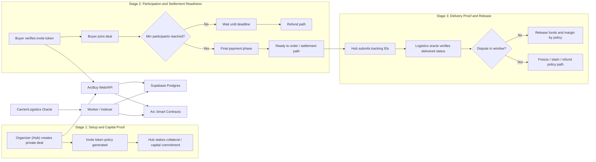
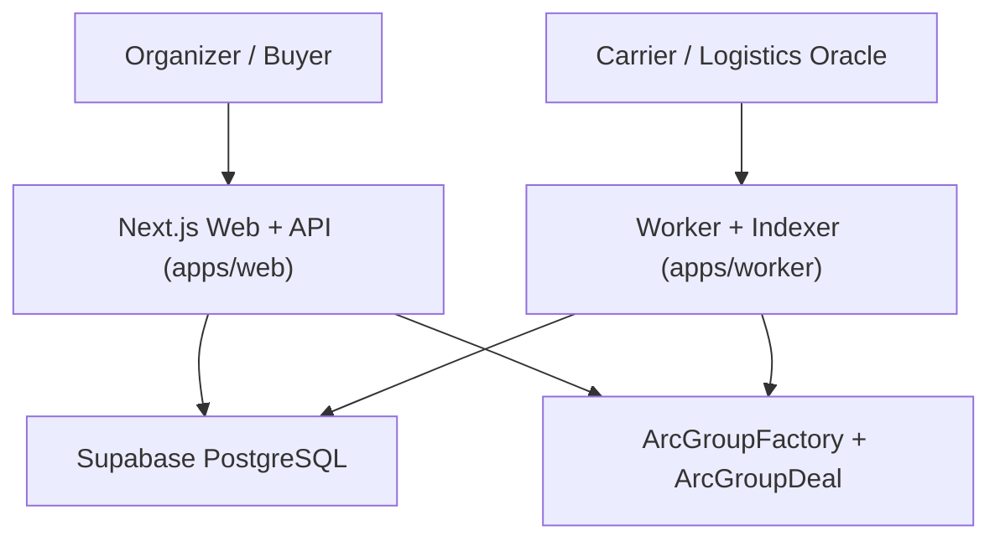
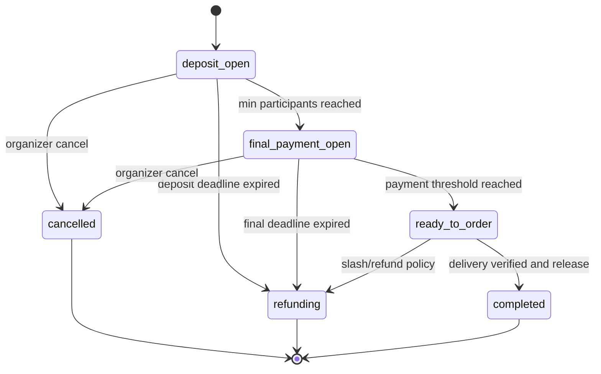

# ArcBuy

ArcBuy is a production-oriented **private group-buy** platform on Arc testnet, inspired by the CircleBuy model from:
- Institutional Group Buy Case Study
- Institutional Group Buy Protocol
- On-chain Trust and Governance

The core idea is to move group-buy from social trust to **programmable trust** with smart-contract rules and auditable operational data.

## End-to-End Infographic



## What Problem ArcBuy Solves

Traditional group-buy channels usually suffer from:
- Counterparty risk (hub disappears with funds)
- Last-mile delivery disputes
- Slow and expensive cross-border settlement
- Idle capital during aggregation windows

ArcBuy addresses this with three proof layers:
- **Proof of Capital**: upfront collateral commitment by organizer
- **Proof of Settlement**: auditable transaction trail
- **Proof of Delivery**: oracle-driven delivery verification

## Business and Protocol Model

From the source materials, ArcBuy follows a 3-stage operational model:
1. **Capital Proof**: organizer stakes before taking buyer capital exposure.
2. **Settlement**: funds move when quorum and lifecycle conditions are met.
3. **Delivery Proof**: release/slash/refund decisions based on verified delivery and dispute policy.

## System Architecture



## Deal Lifecycle



## Current MVP Features

- Private deal creation with signed invite token issuance
- Invite token verification before joining
- Join flow by `dealAddress + inviteToken + participantWallet`
- Deal list and detail views with membership data
- Worker sync for on-chain `DealCreated` events
- Lifecycle sweeps for deadline-based transitions
- Health and readiness endpoints for deployment checks

## API Surface

- `POST /api/deals`
  - Create/update a private deal and return `inviteToken`
- `GET /api/deals`
  - List deals (`?status=` supported)
- `GET /api/deals/:dealAddress`
  - Deal detail + memberships
- `POST /api/invites`
  - Verify invite token
- `POST /api/deals/:dealAddress/join`
  - Join private deal
- `GET /api/health`
  - Liveness + DB ping
- `GET /api/readiness`
  - Readiness checks (env + DB)

## Repository Structure

```txt
apps/
  web/         Next.js UI + API routes
  worker/      Event indexer + lifecycle reconciliation
packages/
  db/          Migration runner + DB record types
  shared/      Shared constants/types/ABI fragments
contracts/     ArcGroupFactory + ArcGroupDeal + tests
supabase/
  migrations/  SQL migrations
.github/
  workflows/   CI
```

## Local Development

1. Install Node.js 20+ and npm 10+.
2. Install dependencies:
   - `npm install`
3. Copy env templates:
   - `apps/web/.env.example` -> `apps/web/.env.local`
   - `apps/worker/.env.example` -> `apps/worker/.env`
4. Run migrations:
   - `npm run db:migrate`
5. Run services:
   - `npm run dev:web`
   - `npm run dev:worker`

## Deployment

- Web/API: Vercel (root `apps/web`)
- Worker: Railway (root `apps/worker`)
- Database: Supabase PostgreSQL pooler URL

## CI/CD Automation

Production auto-deploy is enabled with:
- `.github/workflows/deploy-production.yml`

On each push to `master`, the pipeline:
1. Runs `npm ci`, `npm run typecheck`, `npm run build`
2. Deploys web (`apps/web`) to Vercel production
3. Deploys worker (`apps/worker`) to Railway

GitHub repository secrets required:
- Vercel: `VERCEL_TOKEN`, `VERCEL_ORG_ID`, `VERCEL_PROJECT_ID`
- Railway: `RAILWAY_TOKEN`, `RAILWAY_PROJECT_ID`, `RAILWAY_ENVIRONMENT_ID`, `RAILWAY_SERVICE_ID`

## Additional Docs

- `docs/business-flow-v1.md`
- `docs/arcbuy-production-technical-plan.md`
- `docs/deployment-runbook.md`
- `docs/superpowers/specs/2026-05-18-arcgroup-design.md`

## Roadmap Notes

This repo is a production-MVP baseline. Planned next layers include:
- Advanced dispute arbitration workflow
- Deeper carrier-oracle integration
- Extended cross-border payout rails
- Policy engine per market/jurisdiction
