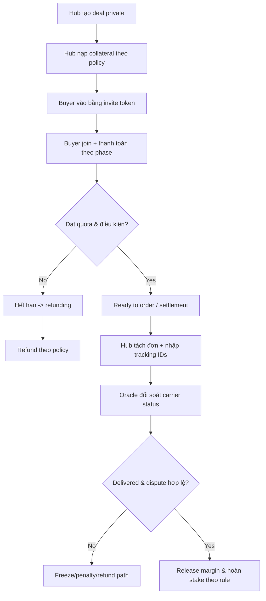
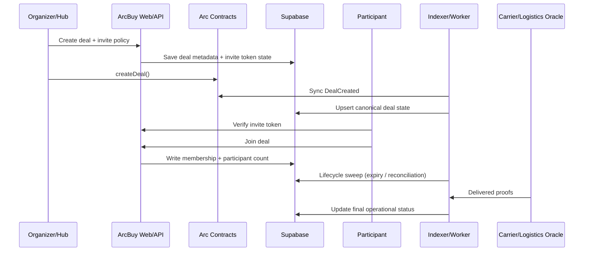

# ArcBuy Business Flow v1

Date: 2026-05-19  
Scope: Private Group-Buy trên Arc testnet theo mô hình CircleBuy (institutional trust, on-chain proof, delivery oracle)

## 1) Executive Summary

ArcBuy là nền tảng mua chung phi tập trung theo mô hình **institutional-grade commerce**:
- Người mua tham gia deal riêng tư qua invite token.
- Hub (organizer) phải stake/collateral trước khi nhận vốn buyer.
- Settlement và trạng thái giao hàng được ghi nhận theo logic on-chain/off-chain có thể kiểm chứng.

Mục tiêu: biến mua chung từ mô hình “tin nhau” sang mô hình “luật contract + dữ liệu bằng chứng”.

## 2) Bài toán thị trường

Mua chung truyền thống đang có 4 điểm nghẽn:
- `Counterparty risk`: Hub có thể ôm tiền.
- `Delivery dispute`: tranh chấp người mua nói chưa nhận hàng.
- `Cross-border friction`: thanh toán quốc tế chậm, tốn phí trung gian.
- `Capital inefficiency`: tiền nằm chờ trong thời gian gom deal.

## 3) Định vị giải pháp ArcBuy

ArcBuy giải quyết bằng 3 lớp bằng chứng:
- `Proof of Capital`: Hub stake upfront theo rule deal.
- `Proof of Settlement`: dấu vết giao dịch có thể audit.
- `Proof of Delivery`: oracle từ carrier API + dispute window.

Ba lớp này tạo thành **Trust Engine** cho private group-buy.

## 4) Stakeholders và lợi ích

### Buyers
- Giảm rủi ro mất vốn.
- Mua theo giá thấp hơn retail.
- Theo dõi trạng thái deal minh bạch.

### Hub/Organizer
- Vận hành deal private có cấu trúc.
- Tự động hóa điều kiện release/refund.
- Xây hồ sơ uy tín (trust score) để scale volume.

### Platform
- Có thể thu service fee theo giao dịch.
- Tạo dữ liệu vận hành chuẩn hóa cho compliance/reporting.
- Mở rộng sang B2B/B2B2C trong phase sau.

## 5) Luồng nghiệp vụ tổng thể

## 6) Luồng hệ thống (on-chain + off-chain)

## 7) Unit economics tham chiếu (theo deck)

Case mẫu “High-speed hair dryer”:
- Retail: `$100`
- Group-buy: `$70`
- Wholesale target: `$50`

Ví dụ 100 đơn:
- Gross revenue: `$7,000`
- Wholesale cost: `-$5,000`
- Bulk shipping: `-$500`
- Last-mile: `-$300`
- Net hub profit: `+$1,200` (`$12/unit`, khoảng `24% ROI` trong case mẫu)

## 8) Risk Matrix (business view)

| Rủi ro | Legacy P2P | ArcBuy |
|---|---|---|
| Hub exit scam | Mất vốn buyer | Slash collateral + refund policy |
| Delivery fraud | Tranh chấp thủ công | Oracle/carrier cross-check |
| FX delay/cost | SWIFT chậm, phí cao | Settlement path tối ưu theo rails |
| Dữ liệu rời rạc | Khó audit | Event + DB audit log |

## 9) North-star KPIs

- `Deal completion rate`
- `Refund latency`
- `Indexer lag (seconds)`
- `Dispute ratio`
- `On-chain/off-chain mismatch count`
- `Repeat buyer rate`
- `Hub fulfillment score`

## 10) Monetization v1

- `Service fee`: 1-5% theo tier.
- `Premium hub tooling`: analytics, operational reports.
- `Future`: dynamic collateral discount cho hub trust score cao.

## 11) Rollout plan

### Phase 1 (now): Production-MVP
- Private deals, signed invite token, deal lifecycle, worker reconciliation, Supabase ops.

### Phase 2
- Oracle integration sâu hơn + dispute tooling.
- Automated settlement connectors.
- Multi-hub governance console.

### Phase 3
- B2B cross-border scale.
- Dynamic staking theo trust score.
- Compliance/audit exports theo thị trường.

## 12) Demo script cho stakeholder

1. Hub tạo deal private và nhận invite token.
2. Buyer verify token và join deal.
3. Dashboard cập nhật participant count.
4. Worker sync event on-chain vào DB.
5. Trình bày flow refund/release theo policy.

---

Tài liệu này dùng cho stakeholder onboarding, grant narrative, và nội bộ product/engineering alignment.
